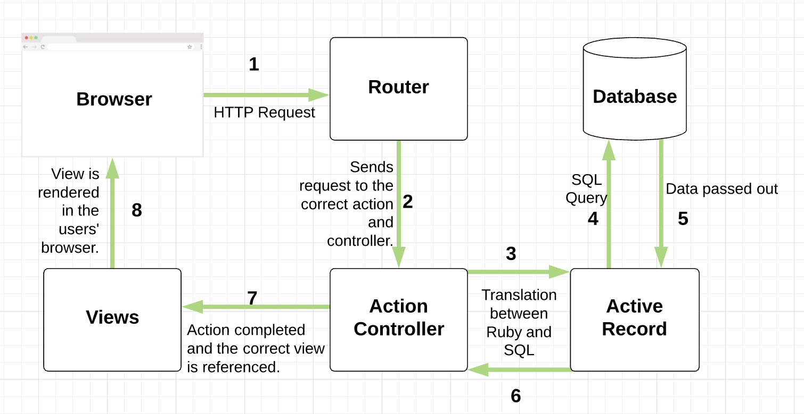
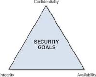
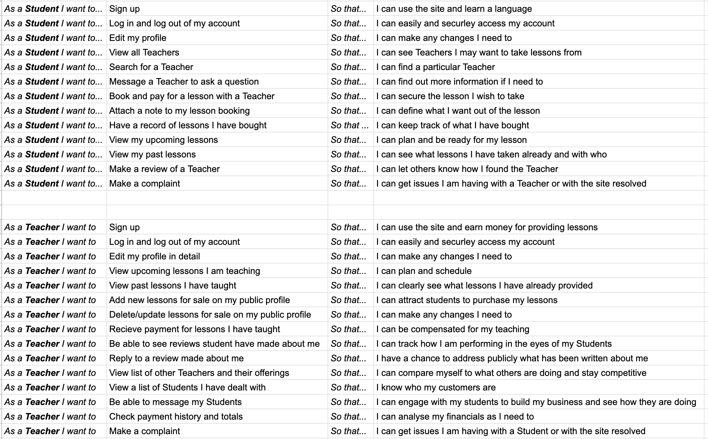

# README
* Ruby version

* System dependencies

* Configuration

* Database creation

* Database initialization

* How to run the test suite

## 1. What is the need (i.e. challenge) that you will be addressing in your project?

## 2. Identify the problem you're trying to solve by building this particular marketplace App? Why is it a problem that needs solving?

## 3. Describe the project will you be conducting and how. your App will address the needs.

## 4. Describe the network infrastructure the App may be based on. 

## 5. Identify and describe the software to be used in your App.

## 6. Identify the database to be used in your App and provide a justification for your choice.

## 7. Identify and describe the production database setup (i.e. postgres instance).

## 8. Describe the architecture of your App.

To illustrate how information flows through the app, I will use the example of a user editing their bio on their profile.

#### Browser
The user can send and receive HTTP requests by interacting with the app through its interface on their browser. There are 4 HTTP requests that are usually made which include:

* GET (to receive information from the database)
* DELETE (delete information from the database)
* POST (send new information to the database)
* UPDATE or PATCH (change or edit information already in the database.)

In our example, the user would press ‘submit’ on a form with the details of what they wanted to edit on their profile. This would send an update or patch request.
#### Router

The routes direct the user’s HTTP requests to the correct controllers, and then the correct actions within that controller. In our example, the users ‘update’ request would be routed to the ‘profile’ controller, and the ‘edit’ action.

#### Action Controller

The action controller is responsible for defining and organising all of the different actions that can be executed on a table in the database. This contains the logic of the application. 

At stage 2 on the diagram, the action controller is responsible for executing the logic contained in the method. The methods usually do this by requesting information from the database or grabbing information from outside of the app (such as through an API). In our example, the new bio of the user would be passed into the ‘edit’ action within the ‘profile’ controller. The edit action then requests that the ‘bio’ field in the ‘profile’ table on the database be altered to the new bio.

At stage 7, once the action has been completed, the action controller will reference the right view file that should be rendered in the user’s browser.

#### Active Record

Active record translates ruby into SQL queries, allowing us to request information easily from the database. It will take the information from the action controller and translate it into an SQL query which will ask the database to find the correct user’s profile, and then their bio column, and alter this to the new bio content.
#### Database

We used a postgresql database - its purpose is to store all the information gathered by the application including users information, history of bookings and lessons available. The database will read and execute the SQL query passed to it from active record. This will then be passed back to active record, and then to the action controller which will then execute step 7 to render a view.

#### Views

Views are what the user sees rendered in their browser as a result of the part of the app that they interacted with. In our example, after they have pressed the ‘edit’ button they would be re-directed back to the last page they visited and a ‘success!’ message displayed.

## 9. Explain the different high-level components (abstractions) in your App.

## 10. Detail any third party services that your App will use.

## 11. Describe (in general terms) the data structure of marketplace apps that are similar to your own (e.g. eBay, Airbnb).

## 12. Discuss the database relations to be implemented.

## 13. Describe your project’s models in terms of the relationships (active record associations) they have with each other. 

## 14. Provide your database schema design.

## 15. Provide User stories for your App.

## 16. Provide Wireframes for your App.

## 17. Describe the way tasks are allocated and tracked in your project.

We used Trello and Slack as our two main tools for tracking tasks and communication. Once we had our vision we worked out an MVP with user stories and wireframes. We then abstracted this into discrete tasks that were allocated to categories in Trello and assigned to team members. Our Trello had categories for Ideation, Design, Build, Testing, Deploy, Strech goals, Documentation and Bug fixes. Each card was updated with a color status to indicate whether it was completed or had issues, with any issues being described in greater detail in the notes and comments section of each card. 

Given the limited time for the project we built out a timeline and worked out which tasks needed to be prioritized to achieve our MVP. Team members worked on different tasks so as to avoid overlap and conflicts. We also used Slack to coordinate pull requests, code reviews and to discuss what our hurdles were to make sure we made consistent progress.

## 18. Discuss how Agile methodology is being implemented in your project.
#### Frequent inspection:
We used git for version control, submitting pull requests kept everybody accountable and ensured that code was always double checked.

#### Adaptation:
We pivoted and adapted to changes in our ERD structure a few times over the course of the assignment. This happened when we realised we had made small mistakes, or thought of better ways to structure our data, and so had to re-do our models. We looked at these realisations as positive improvements, and instead of ignoring them, we adapted to this.

#### Accountability + Teamwork:
Using a Kanban board on trello was very effective at keeping us accountable - once tasks were assigned, our name was added to them and we had the responsibility of marking them off as complete once they were done. As a team, we spent some time at the start and end of each day to set goals and debrief about what we wanted to get done that day. We truly worked together, asking each other for opinions when we got stuck. There was a very encouraging dynamic within the team.

#### Iterative development:
This was implemented from day one, when we defined clearly what our MVP would look like for Chatr. However, no ideas were totally shot down - we added them all to our ‘stretch goals’ list on our trello board. This allowed us to clearly prioritise tasks in order to ensure that we were focusing on building the most important core features of the app.

## 19. Provide an overview and description of your Source control process.

## 20. Provide an overview and description of your Testing process.

## 21. Discuss and analyse requirements related to information system security.
Information security measures attempt to address one of the following three broad goals:  
* Protect the confidentiality of data
* Preserve the integrity of data
* Promote the availability of data for authorized use

This is represented in the figure below.

The aim of integrity models is to ensure data is kept untampered and trustworthy by protecting system data from accidental or intentional changes by unauthorised parties or hackers.

Availability models aim to make certain that data and resources are always available for authorized users. For example the model needs to take into consideration unexpected and irregular events such as emergencies, disasters, DDOS attacks and equipment failures. An example of this would be making data redundant across a number of different physical locations and having backup servers.

Confidentiality models act to safeguard information from people that are unauthorized to view or access it. The confidentiality principle prescribes that information should only be viewed by users with the correct privileges

## 22. Discuss methods you will use to protect information and data.
Sensitive data used by chatr includes card and payment information, user schedules and contact information, and passwords. 

#### Payment information: 
Stripe forces HTTPS using TLS (transport layer security). This ensures that data transferred between two users is encrypted before being sent. Stripe uses separate infrastructure for their website and API to the infrastructure they use for storing personal information and information relating to decryption. None of their internal servers can get plaintext card numbers.
Passwords: We used Devise to secure our website, so user’s passwords are encrypted.

#### Submitting Forms: 
Rails protects against injection attacks by including a unique authorisation token when a form is submitted.

#### User-to-user security: 
Because there is personal information attached to users’ profiles, you must create an account and be authorised to access the website and see tutors and students profiles and available lessons. We used pundit to implement in-site authentication to prevent users from seeing information that should not be available to them, such as the previous lessons of other users.

## 23. Research what your legal obligations are in relation to handling user data.

Australian privacy laws relate to the obligations of a business with respect to how they manage user’s personal data. Specifically a business must collect and store data in such a way as to guard against : theft, misuse, interference, loss, unauthorised access, modification and disclosure.

The business must also only collect personal information to the extent that it is necessary for the function or activity of the business. With relation to our application, if we deployed in a public environment then it would be good practice to include terms of service on the site along with a disclosure statement outlining to our customers what types of information about them we collect and how it is used. We would need to ensure that we are consistent with the service agreement in terms of the use of the data in our application.

We have taken some steps in meeting our obligation via the use of devise and pundit for authentication and authorisation respectively. These gems help to restrict who can access and modify particular data. For example Devise ensures that user passwords are encrypted. 

If scaled, protecting user data would extend beyond just what happens in the code and would include policies around admins and the kinds of resources they can access and change along with the processes for doing so.

Implementing a log system for tracking timestamps of any changes made to resources would be important for understanding if anything goes wrong and being able to investigate security issues.
Data redundancy and backup is a consideration also. If our server is compromised or destroyed we need to be able to retrieve our customers details still.
